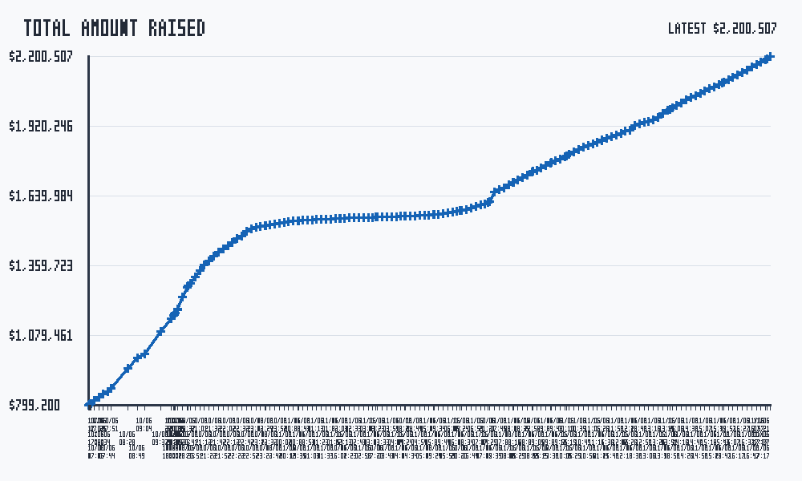

# Raised Amount Monitor

This repository tracks the raised amount shown on the One Nation donation page:

https://donate.onenation.org.au/fire-the-liar

The Python application in `raised_amount_monitor.py` fetches the page, extracts the displayed raised amount, appends a timestamped row to `raised_amount_log.csv`, and regenerates `graph.png` from the collected CSV history.



GitHub may cache the image preview shown above. For the latest generated graph, click the image to open `graph.png` directly, or check the latest rows in `raised_amount_log.csv`.

## Generated Files

- `raised_amount_log.csv` contains the timestamped amount history.
- `graph.png` is regenerated from the CSV data after each successful run.

## How Updates Work

The GitHub Actions workflow in `.github/workflows/run-python-app.yml` asks GitHub to run the monitor every ten minutes. In cron notation, that schedule is written as:

```cron
*/10 * * * *
```

Read literally, that means "run every tenth minute, no matter the hour, day, month, or weekday."

On each scheduled run, GitHub Actions:

1. Checks out the repository.
2. Sets up Python.
3. Runs `python raised_amount_monitor.py`.
4. Commits and pushes any changed files after the script completes successfully.

If the script fails, no commit is made. If the script succeeds but does not change any files, the workflow exits without creating an empty commit.

GitHub treats scheduled workflows as best effort, so this repository requests an update every ten minutes, but the actual run may happen a little later when GitHub has a runner available.

## Running On Demand

The workflow can also be run manually from GitHub:

1. Open the repository's **Actions** tab.
2. Choose **Run Python app**.
3. Select **Run workflow**.

That ad hoc run follows the same process as the scheduled run: it runs the monitor, then commits and pushes any updated CSV or graph output.

## Running Locally

Run the monitor manually with:

```bash
python raised_amount_monitor.py
```

Optional arguments are available for using a different URL, CSV output path, or graph output path:

```bash
python raised_amount_monitor.py --url "https://example.com" --output raised_amount_log.csv --graph graph.png
```
